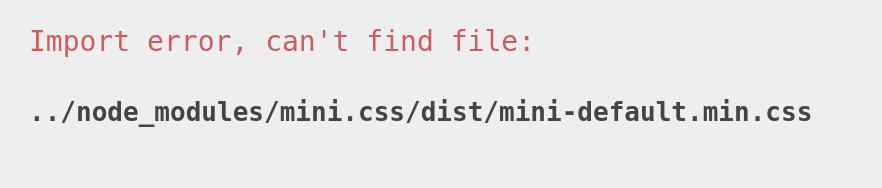

# QuizMakerCertNba

This project was generated with [Angular CLI](https://github.com/angular/angular-cli) version 16.0.0.

## Advice

If you are facing this bug on Stackblitz

Don't worry, this is a known bug of Stackblitz platform. 
To fix it, force server to re-serve by adding a change in the project (Add a whitespace on the README.md file for example)
